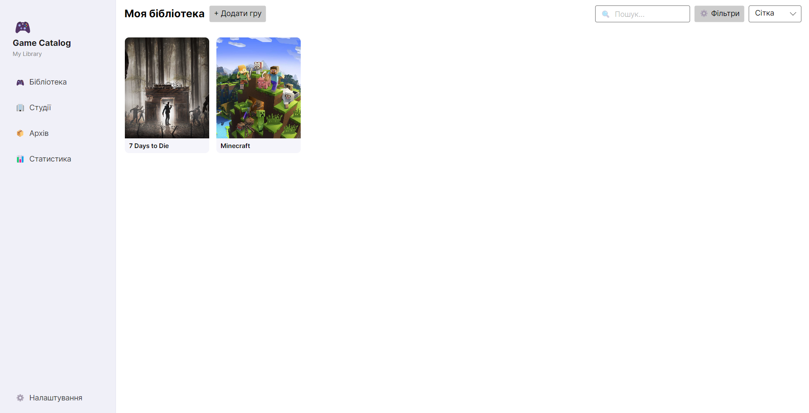
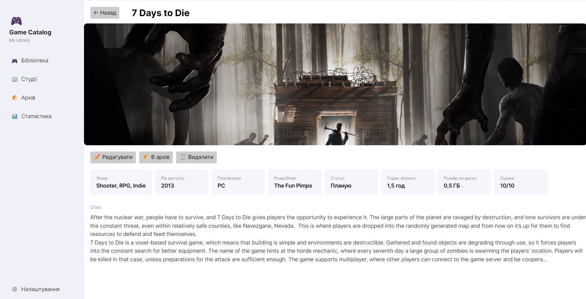

# 🎮 Game Catalog

[](LICENSE)
[](https://dotnet.microsoft.com/)
[]()

Персональний каталог відеоігор із підтримкою RAWG API. Веди бібліотеку ігор, керуй студіями-розробниками, архівуй пройдені ігри та стеж за статистикою колекції.

<p align="center">
  
  &nbsp;
  
</p>

---

## Можливості

- **Бібліотека** — перегляд у вигляді сітки або списку, пошук і фільтрація за жанром, платформою, розробником і статусом
- **Студії** — окрема база розробників із детальною сторінкою кожної студії та списком її ігор
- **Архів** — ігри, перенесені з бібліотеки; можна відновити або видалити назавжди
- **Статистика** — кількість ігор, зіграні години, зайнятий простір на диску, середня оцінка
- **RAWG інтеграція** — автоматичне підтягування жанру, платформи, опису та обкладинки під час додавання гри
- **Теми** — темна та світла, перемикаються миттєво
- **Автозбереження** — усі зміни зберігаються у фоні автоматично

---

## Встановлення

### Реліз

Завантаж актуальну версію зі [сторінки Releases](https://github.com/casidor/Game-Catalog/releases):

| Платформа | Файл |
|-----------|------|
| Windows (installer) | `GameCatalog-Setup.exe` |
| Windows (portable) | `GameCatalog-win-x64.exe` |
| Linux | `GameCatalog-linux-x64` |

На Linux після завантаження дай файлу право на виконання:

```bash
chmod +x GameCatalog-linux-x64
./GameCatalog-linux-x64
```

### Збірка з вихідного коду

Потрібен [.NET 10 SDK](https://dotnet.microsoft.com/download).

```bash
git clone https://github.com/casidor/Game-Catalog.git
cd "Game-Catalog/Game Catalog"
dotnet run
```

---

## Перший запуск

При першому відкритті запуститься майстер початкового налаштування:

1. **Тема** — темна або світла
2. **Розмір диску** — доступне місце для ігор (використовується у статистиці)
3. **RAWG API Key** — необов'язково; дозволяє автоматично знаходити інформацію про ігри

---

## RAWG API

[RAWG](https://rawg.io/) — безкоштовна база даних ігор. З API ключем застосунок шукає гру за назвою прямо у формі та автоматично заповнює жанр, рік, опис і обкладинку.

Отримати ключ: [rawg.io/apidocs](https://rawg.io/apidocs) — безкоштовно, без обмежень для особистого використання.

Вкажи ключ під час першого запуску або пізніше у розділі **Налаштування**.

---

## Дані та зберігання

Усі дані зберігаються локально:

| ОС | Розташування |
|----|-------------|
| Windows | `%APPDATA%\GameCatalog\` |
| Linux | `~/.config/GameCatalog/` |

- `data.json` — бібліотека, студії, архів
- `settings.json` — налаштування
- `covers/` — завантажені обкладинки

---

## Структура проєкту

```
Game Catalog/
├── Models/          # Моделі даних (Game, Studio, AppSettings...)
├── ViewModels/      # Логіка представлення (MVVM)
├── Views/           # XAML-розмітка та code-behind
├── Services/        # DataService, SettingsService, RawgService
├── Converters/      # Value converters для data bindings
└── Validation/      # Атрибути валідації
```

---

## Клавіатурні скорочення

| Клавіша | Дія |
|---------|-----|
| `F1` | Довідка |
| `Enter` | Підтвердити / зберегти |
| `Esc` | Скасувати / закрити діалог |
| `Tab` / `Shift+Tab` | Перехід між полями форми |

---

## Ліцензія

Розповсюджується під ліцензією [MIT](LICENSE).
